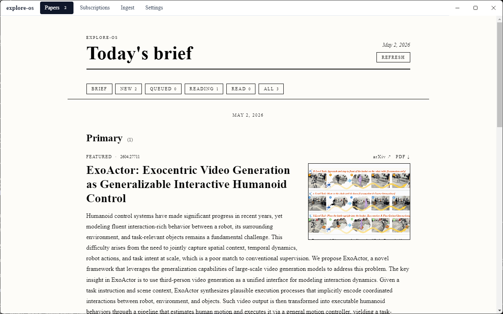
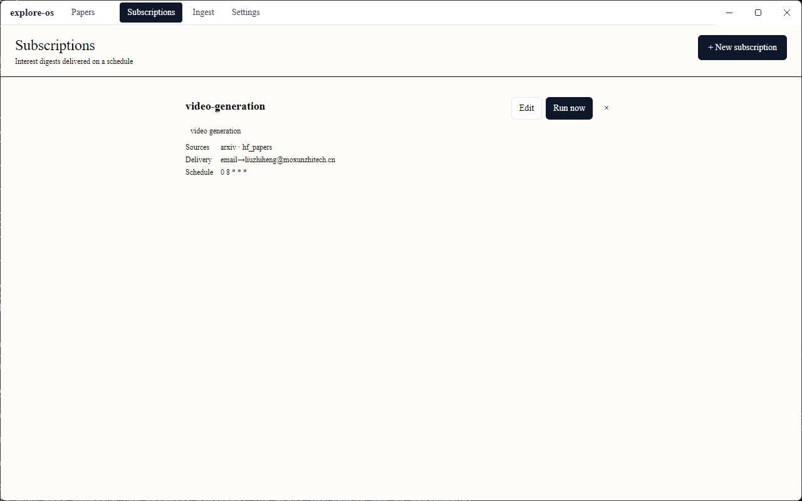
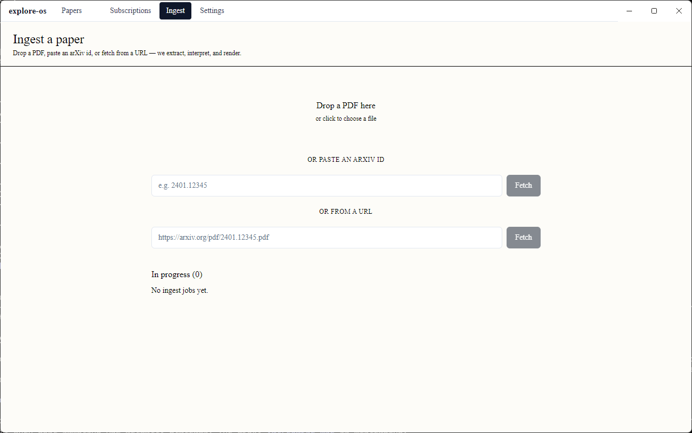
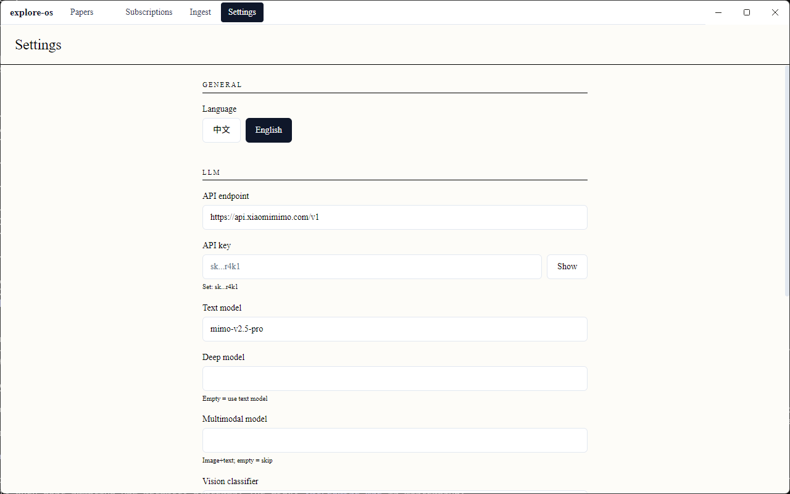

# explore-os

订阅驱动的论文日报助手。每日按你声明的研究兴趣自动检索 arXiv / HuggingFace Daily Papers，
分档解读（略读 + 精读）+ 跨篇主题合成，邮件推送。

> 状态：**MVP 已达成**（v0.4），自用可日常运行。详见下文「现状」。

---

## 它做什么

```
你订阅的兴趣（如"video generation"）  ──┐
                                       ├─► 每日触发 ──► 邮件推送
arXiv / HuggingFace Daily Papers 信源 ──┘
```

每篇论文产出**两档解读**：

- **略读卡**（每篇都有）— 标题 + 中文翻译 abstract + 折叠英文原文 + 框图 + 效果图 + 关键词
- **精读卡**（综合分 Top-1~3）— 略读全部 + 方法摘要 / 关键创新 / 局限 / 视角解读 / 表

邮件顶部 **Daily Narrative** 跨篇主题合成，告诉你今天领域在聊什么。

## 设计原则（写入 [`CLAUDE.md`](CLAUDE.md)）

```
确定性产出 → 工具化（代码 + 规则 + 缓存）
需要语义理解 / 动态编排 → LLM
LLM 是「填补 / 扩充」边界的，不是「替代规则」的
```

具体应用：caption 抽取、bbox 渲染、规则去重 = 工具；
兴趣翻译、解读合成、跨篇 narrative = LLM。

## 技术栈

- Python 3.12 + Django 5 + DRF（CLI + REST API 双面）
- uv 依赖管理 / **SQLite**（桌面 app 长期形态，2026-04-28 弃 PG）
- React 18 + TS strict + Tailwind + shadcn/ui + Electron（v1.1 起前端 + 桌面壳）
- httpx + tenacity（fetcher）/ pymupdf + pymupdf4llm（PDF / caption）/ docling（结构化抽取）
- 阿里云百炼（DashScope OpenAI 兼容）
  - 文本：`deepseek-v4-flash`（rewriter / skim 翻译 / deep interpret / narrative）
  - embedding：`text-embedding-v3`（综合分相关性）
  - 多模态模型已留接口（`qwen3.6-plus` / `qwen-vl-plus`），ft-014 默认不走

## 应用界面

应用提供 Web UI（Electron 桌面端或浏览器访问）。

### Papers 论文列表页



- 左侧订阅管理面板：显示已配置的订阅，可编辑/运行
- 中间论文卡片：显示论文标题、关键词、收录时间
- 顶部状态筛选：All / New / Read / Archived

### Subscriptions 订阅管理页



- 新建订阅：设置名称、兴趣关键词、数据源、交付方式
- 视角选择：researcher / engineer / pm / student
- 交付设置：tldr（略读）或 deep（精读）

### Ingest 摄入页



- 拖拽上传：拖入 PDF 文件自动解析
- URL 输入：输入 arXiv URL 自动拉取
- 运行订阅：手动触发一次检索运行

### Reading Station 论文阅读页（在论文详情页点击进入）



- 三栏布局：目录树 + 论文正文 + ClaimCard
- 支持 KaTeX 公式渲染
- claim 证据展开、反向信号标记

### Settings 设置页

- 语言：English / 中文
- LLM 配置：API 端点、Key、模型选择
- 数据目录：可自定义数据存储路径

---

## 快速开始

```bash
git clone <repo> && cd explore-os
cp .env.example .env             # 填 LLM_API_KEY / SMTP / 收件箱
cp subscriptions.example.yaml subscriptions.yaml   # 改成你的兴趣
uv sync
uv run python manage.py migrate  # SQLite 自动建库（EXPLORE_OS_DATA_DIR/explore_os.sqlite3）
uv run python manage.py run_subscription <name>   # 默认拉昨日（Asia/Shanghai）
```

调度：v1.1 起 APScheduler in-process（Electron sidecar 内置）。CLI 模式仍可用系统 cron / Windows 任务计划早 8 点跑一次。

### CLI 常用参数

| 参数 | 用途 |
|---|---|
| `--target-date YYYY-MM-DD` | 指定日（默认昨日） |
| `--dry-run` | 打印 plain body 不发邮件 |
| `--no-llm` | 跳过所有 LLM 调用，纯字段级 pipeline |
| `--no-deep` | 精读跳过 PDF + 深度解读 |
| `--no-figures` | 不拉 PDF / 不渲图（最快验证渲染） |
| `--ignore-memory` | 调试时跳过跨 run 去重 |
| `--limit-per-source N` | 每个 source 上限 |

## 订阅配置（YAML 格式）

```yaml
subscriptions:
  - name: video-generation-daily
    enabled: true
    perspective:
      preset: researcher        # researcher | engineer | pm | student
      # custom: "我是博士生……"  # 自由文本，优先级高于 preset
    interests:
      - "video generation"
      - "text-to-video"
      - "video diffusion"
    exclude:
      - "medical imaging"
    sources:
      - key: arxiv
        params: {categories: [cs.CV, cs.LG], limit: 30}
      - key: hf_papers
        params: {limit: 20}
    deliveries:
      - channel: email
        # to: ...    # 不写则用 .env 的 EMAIL_TO_DEFAULT
        depth: tldr
        max_items: 15
```

## 项目结构

```
config/                  Django settings / urls
sources/                 信源（arxiv / hf_papers）+ PDF 拉取/渲染
interpret/               rewriter / ranker / skim / deep_interpret /
                         narrative / caption_extractor / figure_picker
delivery/                email_renderer / email_sender
subscriptions/           loader / memory / run_subscription 命令
media/                   PDF 缓存 / 图渲染 / memory（已 gitignore）
docs/pm/                 ROADMAP / Features / Iterations / CHANGELOG
```

## 现状（2026-04-25）

```
v0.1  MVP 端到端                 ✅ ft-001~007（DB 落库改走 YAML+jsonl）
v0.2  注意力分层                 ✅ ft-008/009/010
v0.3  精读深度化                 ✅ ft-011；ft-012 superseded by ft-013
v0.4  caption+bbox + 记忆线 +     ✅ ft-013/014
       双档卡片重设计
```

13 个 feature done / 1 superseded / 105 单元测试通过 / 多次实战邮件投递 OK。

### 单次跑预估

| 维度 | 数值 |
|---|---|
| 时间 | ~1 分钟 |
| LLM 调用 | rewriter 1 + skim N + deep K + narrative 1（K=Top-N，N=入选数） |
| LLM 成本 | ~0.3 元 / 次 |
| 多模态调用 | **0** |
| 网络 | arXiv PDF 5–30 MB × N（首次；缓存后近零） |

## MVP 评估

✅ **达成。** 评估维度：

| 维度 | 目标 | 现状 |
|---|---|---|
| 自用日报跑通 | 单条 CLI 端到端发出邮件 | ✅，多次验证 |
| 信源能力 | 至少 2 个稳定信源 | ✅ arXiv + HF Papers，跨源去重 |
| 解读质量 | 略读 + 精读两档分明 | ✅ 中文翻译 + 多图 + 结构化深度 |
| 推送质量 | 邮件可读、有图有内容 | ✅（受限于发件域 SPF/DKIM 仅企业邮箱可收） |
| 状态持久化 | 跨 run 去重 + 历史可查 | ✅ memory jsonl + digests.md |
| 成本 | 单次跑 < 1 元 | ✅ ~0.3 元 |
| 时长 | 单次跑 < 5 分钟 | ✅ ~1 分钟 |

**严格说已超越 MVP 边界**——原 v0.1 MVP 只要求 TL;DR + 邮件，
现在是结构化精读 + 跨篇合成 + 跨日记忆。

## 已知 limitations / 后续候选

- **SMTP 域名 SPF/DKIM 未配** → Gmail 拒收，目前只投企业邮箱。修 DNS 即可解锁。
- **HF Papers 时间错位** → HF dailypapers 收录日 ≠ arxiv 提交日，target_date 严格过滤会让 HF 命中数偏少。可加 ±1 天容差。
- **arch 图选取**：关键词命中可能选中方法图而非 teaser 图。"Fig 1 优先 + 关键词加持"是更好的启发。
- **MuPDF Screen annotation 警告**：noisy stderr，可重定向到 log 文件。
- **`figures_root()` 名字遗留**：路径下既存图也存其他衍生物，命名将随后续重构调整。

## 长期方向

1. 完善 skill 边界（每个能力一个清晰接口；准备 OpenClaw 化抽象）
2. 引入 orchestrator 分支编排（"今日空了→拉前一天补漏"等动态行为）
3. 历史回填 + 月度/半年度回顾报告（基于 memory papers.jsonl）
4. 新增 source（GitHub trending / repo release / 知乎专栏 RSS）
5. 提取为可分发 package + CLI

## 设计参考 / 致谢

- 参考项目 `xingsuo`（OpenAlex 图谱）—— 仅借鉴 query rewriter 思路
- 阿里云百炼（DashScope）多模态推理能力

## License

见 [LICENSE](LICENSE)。

---

详细规划见 [`docs/pm/ROADMAP.md`](docs/pm/ROADMAP.md)。每次迭代变更见 [`docs/pm/CHANGELOG.md`](docs/pm/CHANGELOG.md)。
